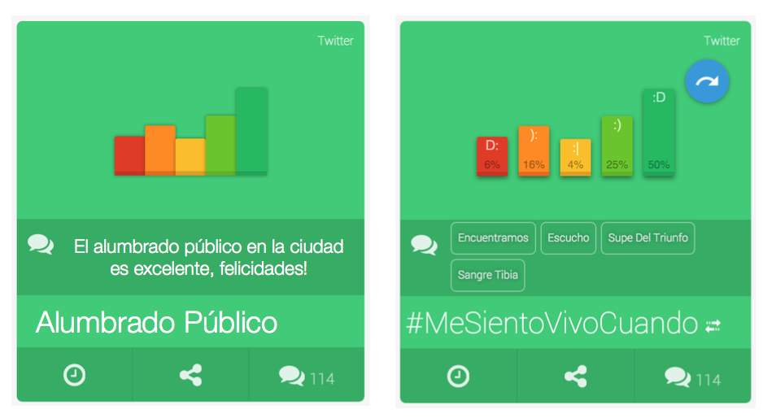
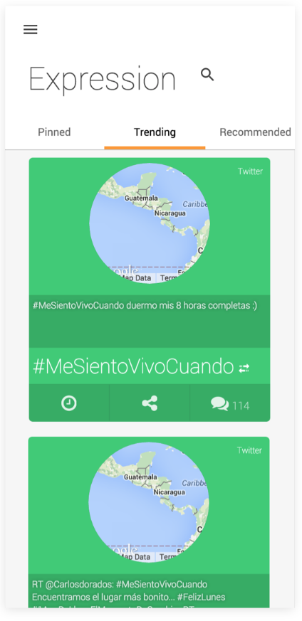
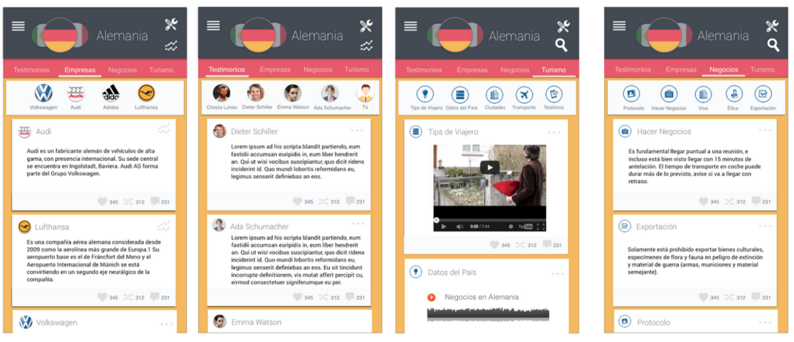

# Expression

Expression is a **WebApp** for **Sentiment Analysis**. A social platform where people can share opinions about topics of interest on real-time. People can start sharing opinions anonymously or sign up to follow topics and get notified when the sentiment and opinion tendency about a topic changes. Expression is a proof of concept prototype. Developed by **Innova4D** research group at **Universidad de las Américas, Puebla**.

Expression is developed using **meteorjs** with a [**reactive design**](http://www.reactivemanifesto.org/) in mind.

## Use

To run the application:

- Install [git](https://git-scm.com/book/en/v2/Getting-Started-Installing-Git)
- Install [meteorjs](https://www.meteor.com/)

```bash
git clone http://github.com/innova4d/expression-meteor
cd expression-meteor
meteor
```

## Development

```bash
git clone http://github.com/innova4d/expression-meteor
cd expression-meteor
git checkout dev0.5 #current development version
atom . #In OSX
```

- [Atom](https://atom.io/), suggested editor.

# Documentation

The project is structured as follows:

- Source code is organized in templates, inside client and views folders.
- The root of the application can be found at index.html.
- Each HTML file comes with their respective CSS and JS file with the same name, concerns are separated with pure JavaScript and CSS code.
- For more detailed information about meteor.js project structure please refer to: docs.meteor.com/#/full/

CSS Notes:
- The distribution of DOM objects in the view relies in the  [flexbox](https://css-tricks.com/snippets/css/a-guide-to-flexbox/) distribution model.

# Screen Shots






